# DGX Spark Cluster — Project Timeline in Screenshots

Screenshots captured during the evening of March 17 and the morning of March 18, 2026, documenting a critical development phase: tuning the Qwen3-235B-A22B MoE model for distributed inference across two DGX Spark nodes, and validating the cluster's end-to-end stack from GPU sharding to UPS monitoring.

---

## Evening Session — March 17, 2026

### Inference Quality Testing after Memory & Context Length Tuning

These screenshots were taken between commits `d3a3756` (22:06 — adjusted context length and memory fraction) and `06c98a3` (22:35 — enabled sharded_state, added repetition detection flag). The user is validating inference quality on the Qwen3-235B-A22B model after tuning `mem_fraction_static` and `context_length` parameters.

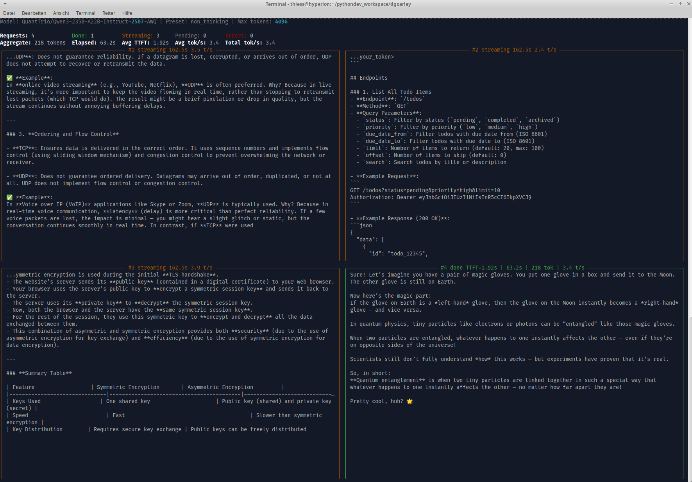

Split-screen terminal showing live LLM inference testing. The left pane displays an OpenWebUI chat session where the Qwen3-235B model generates a detailed response about cryptography — symmetric vs. asymmetric encryption, public key exchange, and digital signatures. The right pane shows the corresponding SGLang JSON API response with structured output. This is the first quality check after the memory fraction and context length adjustments, verifying that the model produces coherent, detailed technical content.

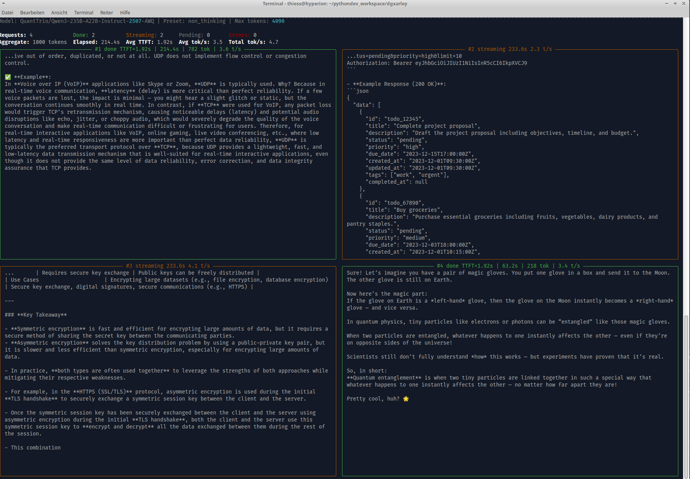

Continuation of the inference quality test. The left pane shows the LLM continuing its cryptography explanation, covering WebSocket protocols and encryption mechanisms. The right pane displays the raw JSON response from the SGLang API. The test validates that longer outputs remain coherent with the newly tuned memory allocation — an important check given the MoE model's 235B parameters spread across two GPUs via tensor parallelism.

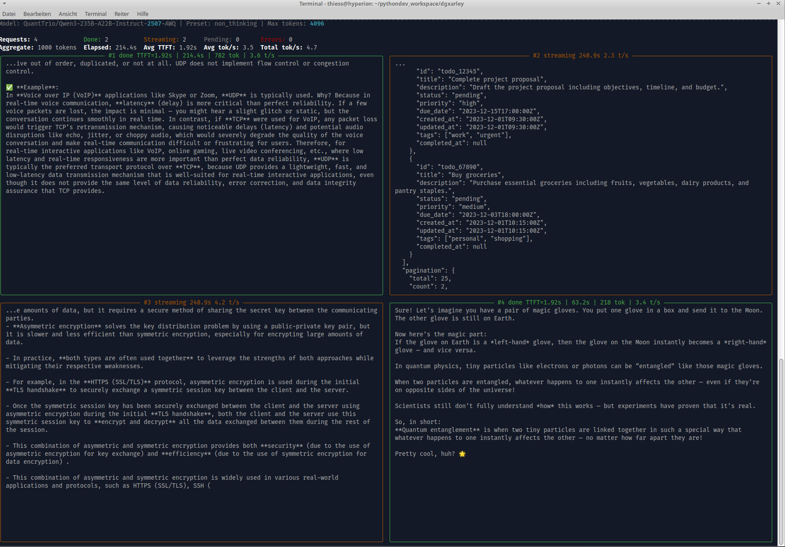

Further continuation of the same cryptography test. The left pane shows detailed content about symmetric and asymmetric encryption with practical examples. The right pane shows JSON-structured output. The consistent quality across this multi-minute generation confirms stable inference with the adjusted `mem_fraction_static` setting.

### Diverse Topic Testing & Repetition Detection

The next series shifts to diverse topics — testing the model on humanities, programming paradigms, and distributed systems theory to evaluate output quality across domains and check for repetition issues.

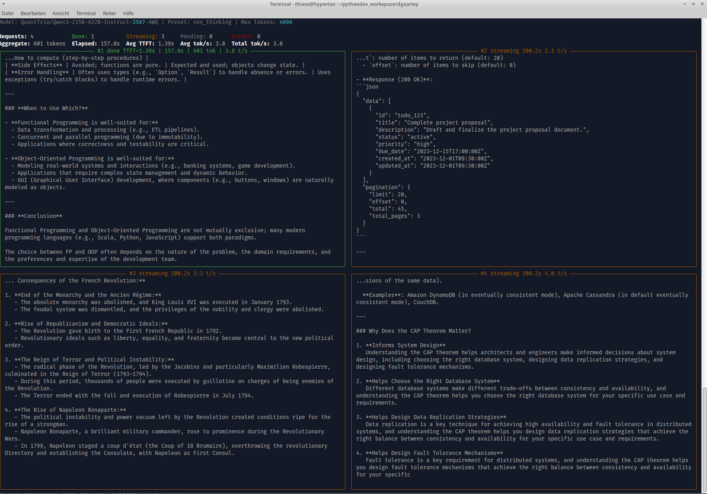

New test prompts with diverse topics. The left pane shows the model generating content about Python programming paradigms (OOP vs. Functional Programming) and the French Revolution. The right pane displays a response about the CAP theorem in distributed systems. This multi-topic testing was done shortly before commit `06c98a3`, which introduced a repetition detection flag — suggesting the user was actively evaluating whether the model exhibited repetitive output patterns.

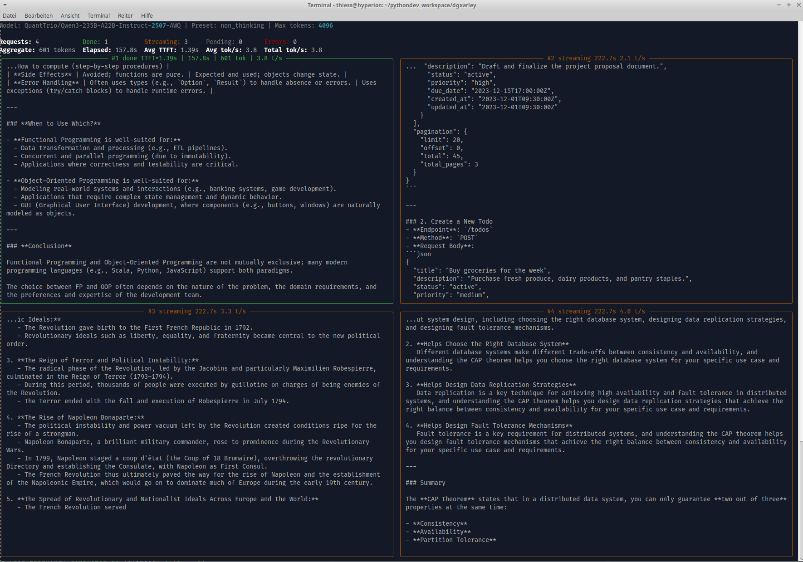

Continuation of the diverse topic test. Left pane shows Python OOP/FP comparison and French Revolution content. The right pane displays the CAP theorem discussion alongside a structured "Create a Todo List" example, testing the model's ability to produce both prose and structured task output in a single session.

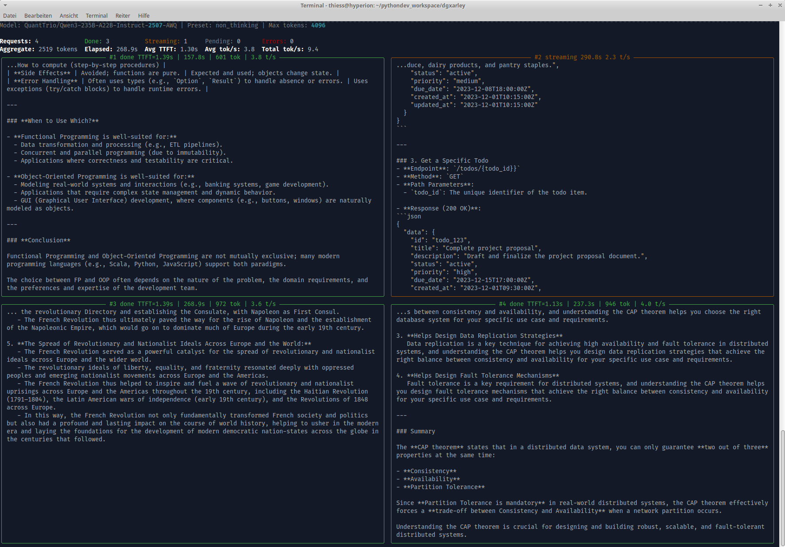

Left pane shows French Revolution historical analysis. Right pane displays distributed systems content — specifically "Design Fault Tolerance Mechanisms" and the CAP theorem. The test evaluates long-form generation quality across both humanities and technical domains, checking that the model maintains topical coherence without degenerating into repetitive patterns.

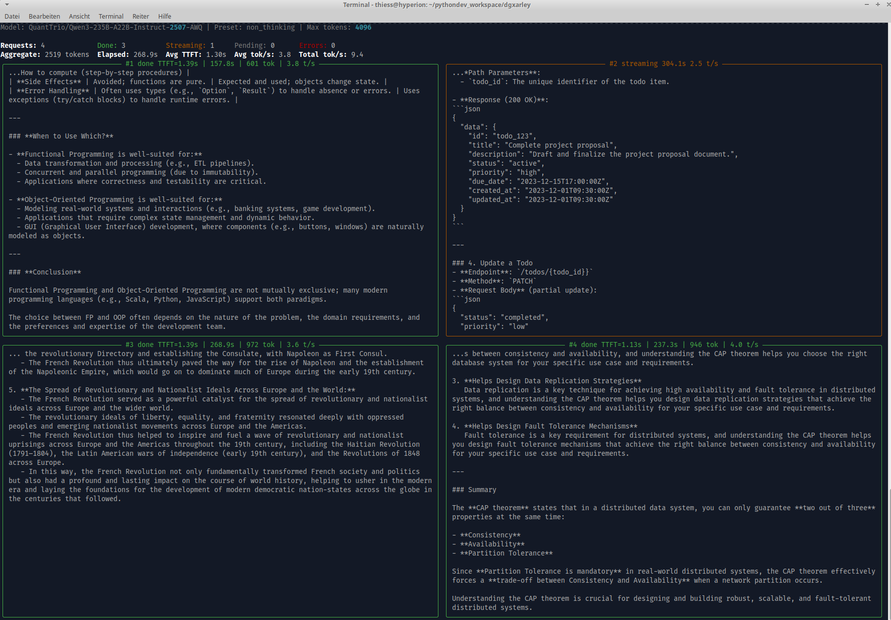

Slightly scrolled view of the same session. French Revolution content continues on the left, distributed systems and CAP theorem on the right. The extended generation length tests the model's ability to sustain quality over longer outputs — relevant for the `context_length` parameter that was being tuned.

### Cluster Monitoring & Inference Benchmarking

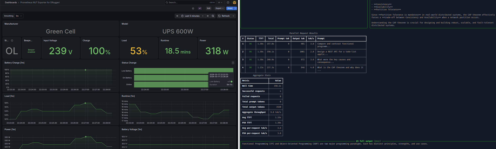

Two distinct views side by side. **Left: Grafana dashboard for the Green Cell UPS 600W** — deployed via the `k8s_infra` role's NUT monitoring stack. Shows the UPS in online (OL) mode, input voltage 239V, battery at 100% charge, 53% system load, 18.5 minutes estimated runtime, and 318W power draw. This captures the cluster's power consumption under active inference load. **Right: SGLang inference benchmark results** — a table showing per-request metrics (Status, TTFT, Total latency, Prompt/Output tokens, tok/s) and aggregate statistics (throughput, latency percentiles). The benchmark validates end-to-end performance with the tuned model parameters.

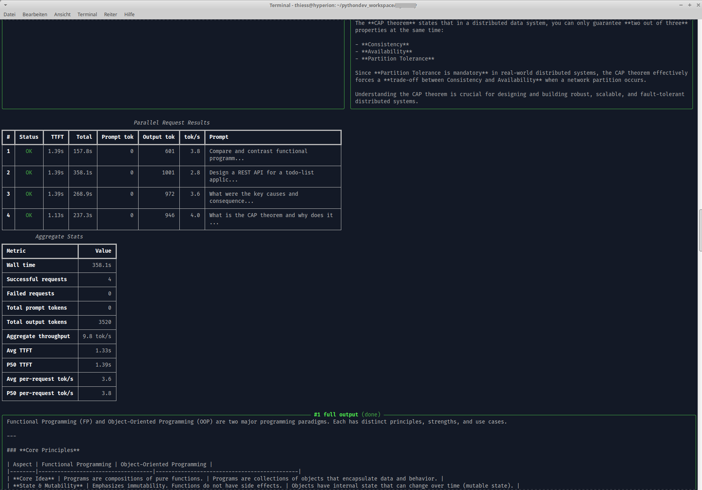

Terminal showing inference benchmark aggregate statistics and a generated text sample comparing Functional Programming and Object-Oriented Programming. The benchmark results confirm the model is performing correctly with the adjusted parameters. The generated text below demonstrates output quality — complete with structured headings and a coherent comparison table, validating that the model is ready for production use.

---

## Morning Session — March 18, 2026

### SGLang Multi-Node Startup with Sharded Model Loading

These screenshots capture the SGLang head pod starting up in K9s after the shard job fix in commit `216ddec` (08:06 — replaced `.shard_complete` marker with `index.json`, added ConfigMap auto-rollout). The user is watching the startup process to verify the sharded model loading works correctly, which would later lead to commit `822068d` (09:42 — patched the SGLang loader to log per-shard progress).

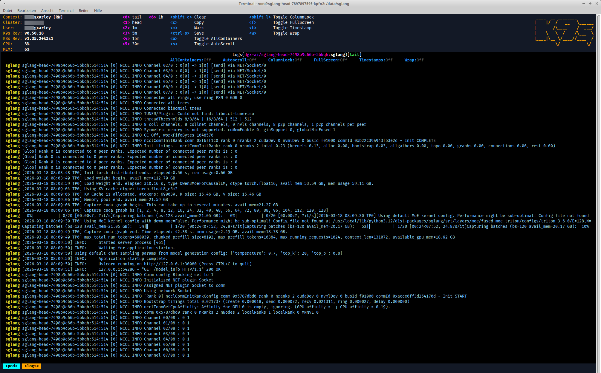

K9s terminal UI showing the SGLang head pod logs during multi-node startup on the K3s cluster. The log shows NCCL channel initialization between spark1 and spark2 over the QSFP P2P link (10 Gbps direct connection). Visible stages: NCCL bootstrap, TCP channel setup, weight loading from the pre-sharded checkpoint, and the beginning of CUDA graph capture. The model is loading with `load_format: sharded_state`, using the shard directory created by the GPU shard job that was fixed earlier that morning.

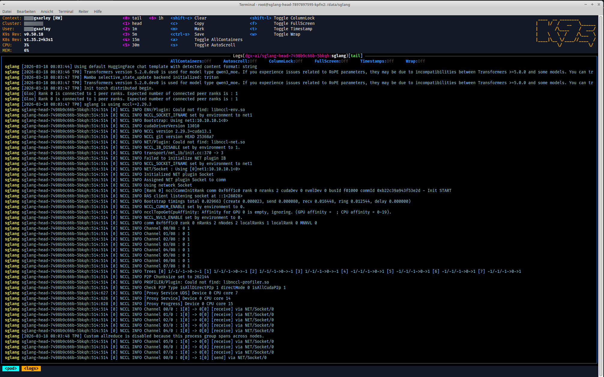

K9s showing an earlier phase of the SGLang head startup sequence. The logs display NCCL bootstrap initialization, Triton attention backend configuration, memory management setup, and GPU device detection. The multi-node NCCL handshake is establishing TCP connections over the QSFP point-to-point link between the two DGX Spark nodes. The `sharded_state` load format is active, bypassing the Marlin repack that would otherwise cause OOM on memory-constrained GPUs.

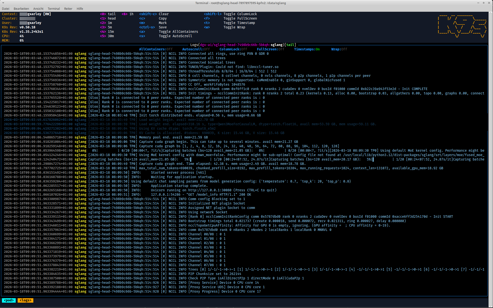

K9s showing the SGLang head startup progressing toward readiness. Key milestones visible in the log: NCCL channels fully connected, weight loading complete, CUDA graph capture beginning, then "Waiting for application" followed by the application starting. **Notably visible: the model's `generation_config` values being read** — temperature, top_p, and top_k values being loaded from the model's `generation_config.json`. This is the exact mechanism that the sampling override feature (implemented later) targets: overlaying custom sampling defaults onto this file before SGLang reads it.

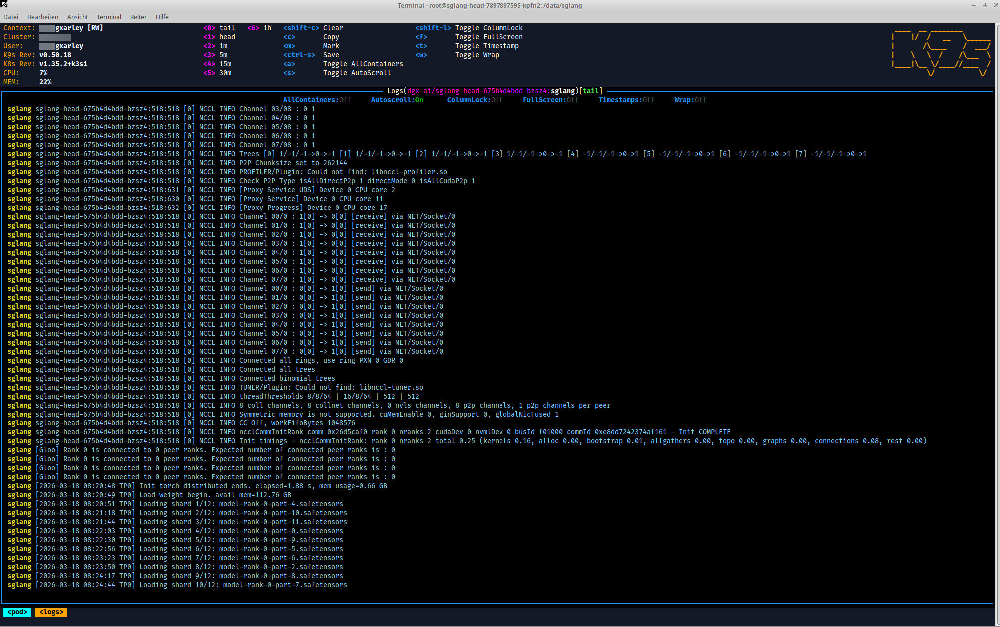

K9s showing the SGLang head startup with **per-shard progress logging** — lines like "Loading shard 3/2..." visible in the output. This is the ShardedStateLoader patch that logs each shard file as it loads, providing visibility into the weight loading phase that previously ran silently. The user tested this patch manually, then committed it as part of `822068d` (09:42). Also visible: NCCL plugin initialization, channel setup across the two-node tensor-parallel topology, and memory allocation for the Qwen3-235B-A22B AWQ model (~62 GB per GPU with the `moe_wna16` quantization).
