# Development Screenshots — dgxarley (March 18–20, 2026)

Documentation of screenshots taken during development of the dgxarley project (SGLang/LLM inference on DGX Spark with K8s), correlated with the corresponding git commits.

---

<video src="https://github.com/user-attachments/assets/17363c3e-2c59-4d7f-880d-f96004da70e0" width="100%" controls></video>
[Bildschirmaufnahme 2026-03-21 15:19:28_blurred.mp4](../media/Bildschirmaufnahme%202026-03-21%2015%3A19%3A28_blurred.mp4)

---

## 1. Bildschirmfoto_2026-03-18_13-39-21_blurred.png

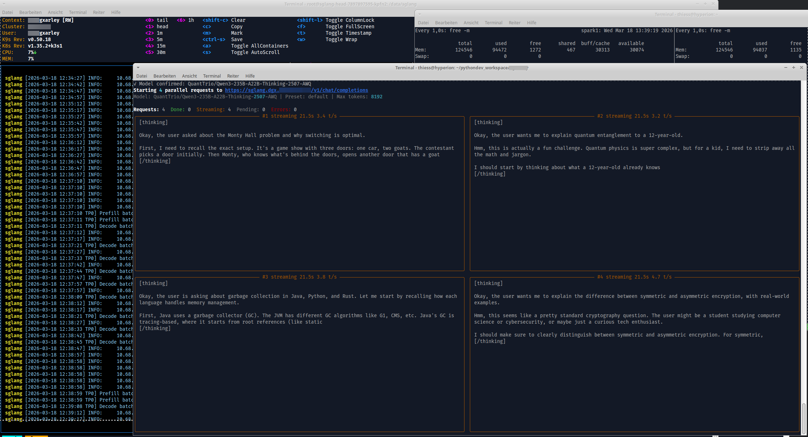

**Description:** Tmux session with multiple panes. Top-left shows a file tree/process list, top-right shows system status (date, uptime). Bottom area split into four quadrants running the parallel-request load test tool (`sglang_integration_test.py`), sending 4 simultaneous LLM requests to the Qwen3-235B model. Visible responses: Monty Hall problem narrative, garbage collection in Java/Python/Rust, symmetric vs. asymmetric encryption. Each pane shows `[Thinking]` blocks followed by generated responses.

**Related Commits:**
- `05639734` (13:09) — *Introduce sampling override functionality with ConfigMap support, update model profiles for Qwen3-235B* — Introduction of the sampling override ConfigMap and model profiles being tested here.
- `d19c8058` (13:24) — *Enable rsync-based metadata sync for shard saves* — Improvement of the shard save process, running in the background alongside inference.

---

## 2. Bildschirmfoto_2026-03-18_14-05-03_blurred.png

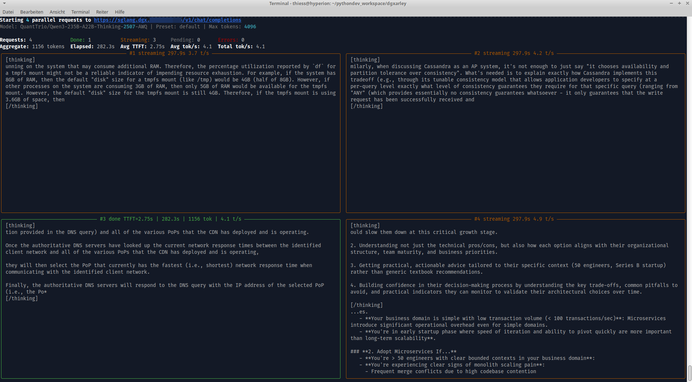

**Description:** Parallel request tool with header info: URL to local API endpoint, ~261s runtime, ~2.7 TPS. Four quadrants showing responses about: RAM availability/heap management, DNS resolution with SDN servers and PoP selection, DNS query handling, and microservices architecture advice for a company at a critical growth stage (DDD, transactions/sec).

**Related Commits:**
- `42344d48` (13:59) — *Refactor parallel load testing prompts to include role definitions and complex questions for increased complexity and token count. Update request stats to track thinking time* — This exact commit introduced the role-based, more complex prompts visible here (Senior Engineer, Backend Developer, etc.).

---

## 3. Bildschirmfoto_2026-03-18_14-13-55_blurred.png

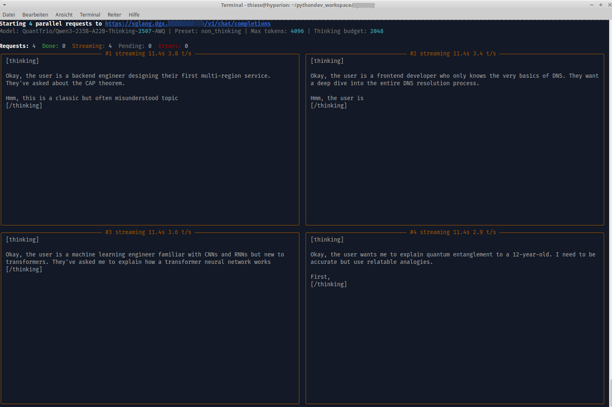

**Description:** Parallel request tool with visible model name `QuantTrio/Qwen2-2358-A238-Thinking-2507-AMZ`, preset `non_thinking`, max_tokens 4000, thinking_budget 2048. Four quadrants: CAP theorem explanation for a backend engineer, DNS resolution process for a frontend developer, Transformer architecture for an ML engineer, and a response just starting to generate.

**Related Commits:**
- `f85cc2f2` (14:18) — *Add `finish_reason` to stats and update table display. Modify `run_parallel_requests` to accept and pass `thinking_budget`* — Screenshot shows the state just before this commit; the `thinking_budget` feature is being tested/developed.

---

## 4. Bildschirmfoto_2026-03-18_14-25-43_blurred.png

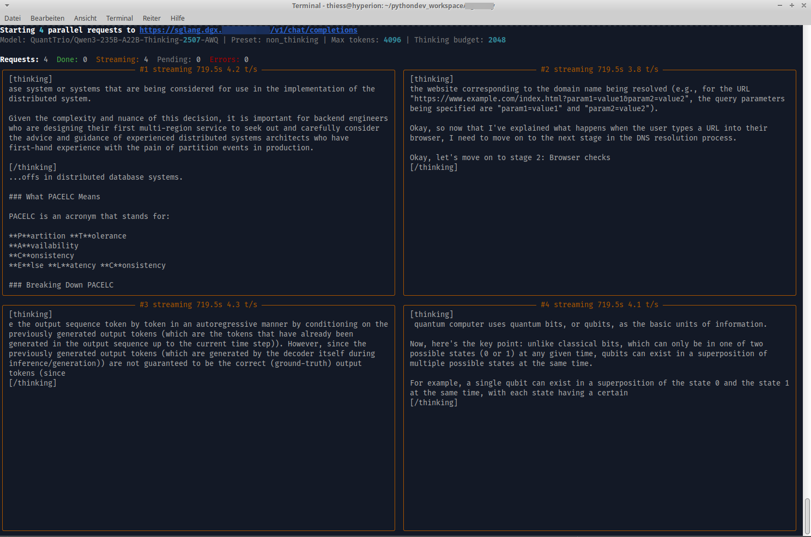

**Description:** Same parallel request setup. Responses about: PACELC theorem (Partition/Availability/Consistency/Latency), URL structure and browser DNS resolution (Stage 2), autoregressive language model token generation, and quantum computing basics (qubits, superposition).

**Related Commits:**
- `f85cc2f2` (14:18) — *Add `finish_reason` to stats* — Just committed; the screenshot shows the tool after integration of the finish_reason feature.
- `0263e0bb` (14:57) — *Add support for chat template kwargs and enable custom logit processor* — Next commit in the pipeline; still testing with existing settings here.

---

## 5. Bildschirmfoto_2026-03-18_15-51-39_blurred.png

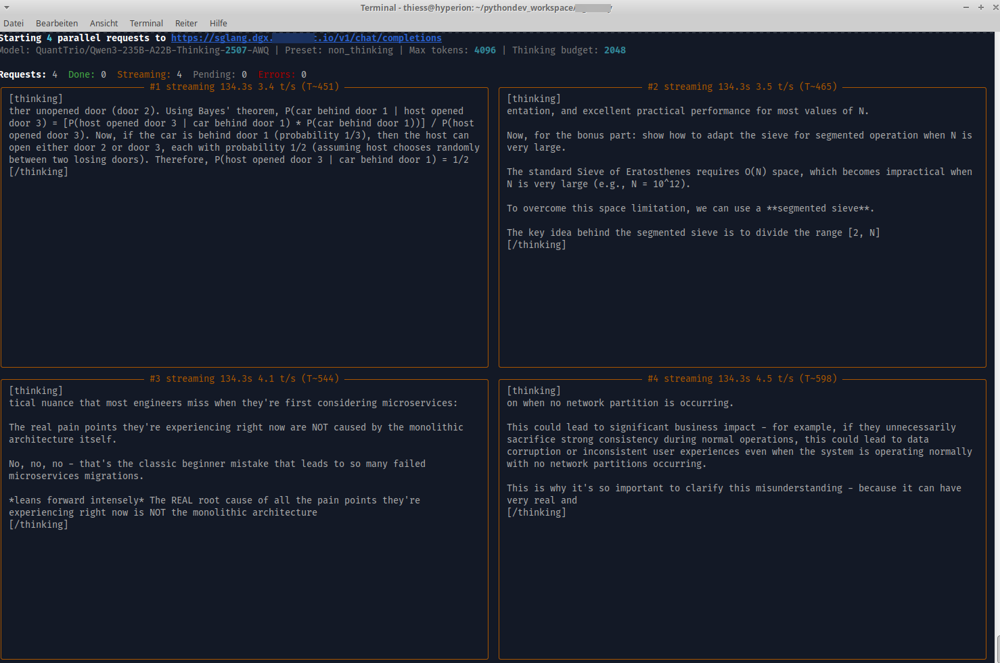

**Description:** Four quadrants with sophisticated responses: Monty Hall problem with Bayes' theorem (probability calculation P(car behind door)), Sieve of Eratosthenes with segmented sieve optimization, microservices migration pitfalls ("the classic beginner mistake"), and network partitions in distributed systems with business impact analysis.

**Related Commits:**
- `0263e0bb` (14:57) — *Add support for chat template kwargs and enable custom logit processor* — The custom logit processor was introduced to improve output quality; the impact on response quality is being validated here.
- `8618c0e0` (16:39) — *Add Keel and Alertmanager Gotify integration* — Monitoring infrastructure work happening in parallel.

---

## 6. Bildschirmfoto_2026-03-18_17-29-30_blurred.png

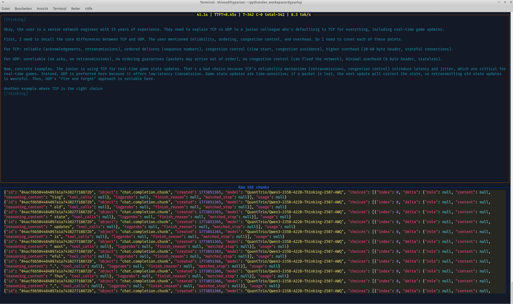

**Description:** New dual-panel layout: top half shows a rendered AI response about TCP vs. UDP for a senior network engineer with 20 years of game server experience (reliability, acknowledgements, retransmissions, head-of-line blocking). Bottom half shows raw JSON SSE stream chunks with fields like `chat_completion_chunk`, `choices`, `delta`, `finish_reason`, `model`. This is the new `sglang_raw.py` tool under development.

**Related Commits:**
- `ef5e1736` (17:58) — *Add SGLang SSE stream viewer with dual-panel Rich display* — Active development of this feature. The screenshot shows an early state of the dual-panel viewer before it was committed.

---

## 7. Bildschirmfoto_2026-03-18_17-35-04_blurred.png

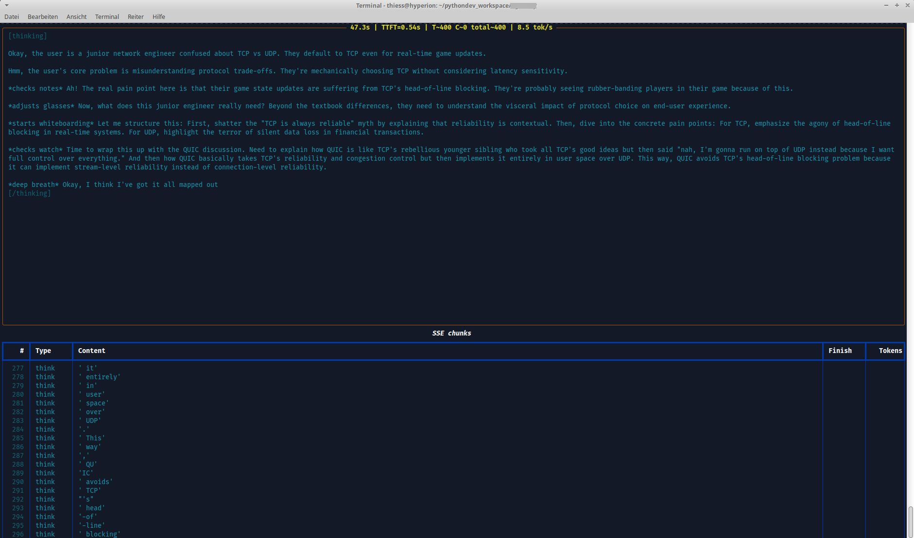

**Description:** Further development of the dual-panel SSE viewer. Top area: TCP response about head-of-line blocking in game clients ("combo-mashing players hit their ping bar"). Bottom area: token table with columns `Type`, `Content`, `Finish`, `Tokens` — showing individual chunks with type classification (`think` vs. `text`), visualizing the separation of thinking and text tokens.

**Related Commits:**
- `ef5e1736` (17:58) — *Add SGLang SSE stream viewer with dual-panel Rich display* — Continued development of the viewer.
- `92775b20` (18:00) — *Refactor logit processor extraction to improve clarity and robustness. Split serialized reference, remove unnecessary parts, decode class name* — Logit processor extraction being refactored in parallel.

---

## 8. Bildschirmfoto_2026-03-18_18-10-42_blurred.png

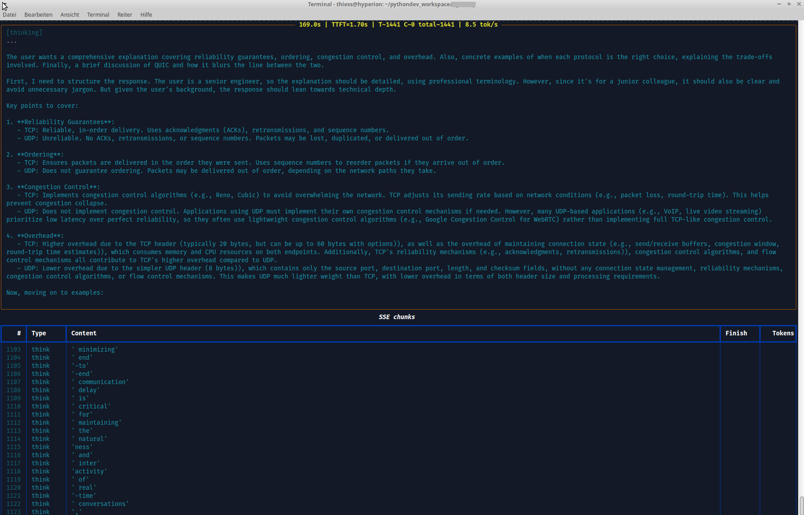

**Description:** SSE viewer with a more mature layout. Top area: detailed TCP vs. UDP analysis — reliability (ACKs, retransmissions, sequence numbers), ordering, congestion control (Reno, CUBIC, BBR), overhead (TCP 20–60 bytes vs. UDP 8 bytes header). Bottom area: token table with `think`/`text` alternation and content fragments. Chunk handling has been optimized for word wrap, panel height is consistent.

**Related Commits:**
- `2f8c66fe` (18:29) — *Adjust sampling parameters and enhance text display logic. Increase presence penalty for better sampling quality, add temperature for randomness. Adjust chunk handling to account for word wrap, ensuring consistent panel height* — Screenshot shows the state just before this tuning commit; the panel height adjustment is being developed here.

---

## 9. Bildschirmfoto_2026-03-18_18-30-08_blurred.png

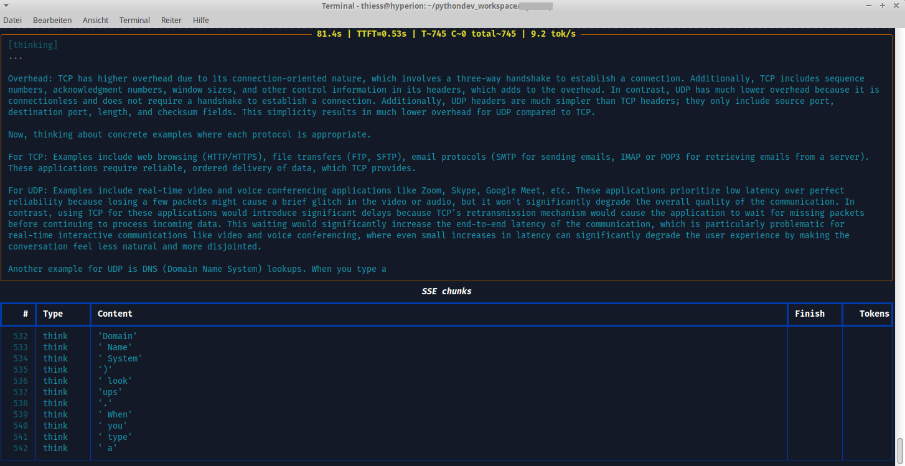

**Description:** SSE viewer (`sglang_raw.py`) in the workspace path. Top area: TCP explanation (three-way handshake, flow control, congestion control). Bottom area: SSE chunks table with numbered entries (~100 range), type `content`, and short token fragments.

**Related Commits:**
- `2f8c66fe` (18:29) — *Adjust sampling parameters and enhance text display logic* — Taken right after this commit; the increased presence penalty and temperature settings are active.
- `3cfdc87d` (19:13) — *Adjust model sampling parameters and refine panel height calculation* — Further fine-tuning of sampling parameters follows next.

---

## 10. Bildschirmfoto_2026-03-19_13-17-26_blurred.png

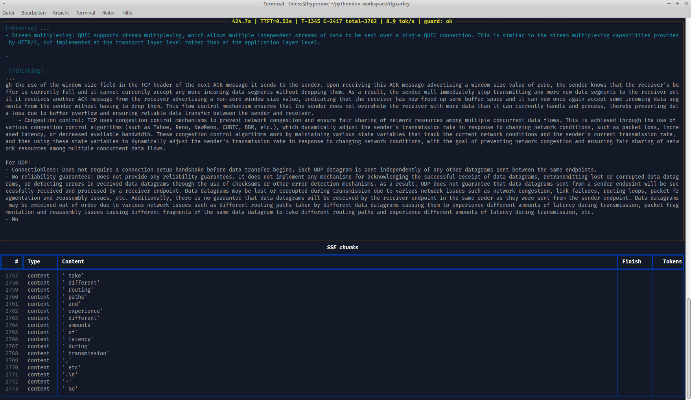

**Description:** Guard CLI tool (evolved from `sglang_raw.py`). Response text about TCP vs. QUIC: stream multiplexing (QUIC native vs. TCP), TCP window size in ACK messages, flow/congestion control mechanisms (slow start, CUBIC, BBR), UDP without connection handshake. SSE chunks table at the bottom with token numbers in the 2700 range.

**Related Commits:**
- `4125a247` (14:07) — *Major refactoring and expansion of the codebase for SGLang integration* — Comprehensive refactoring of integration tests, new module structure (`dgxarley/integration/`), repetition detector, streaming repetition guard. This screenshot shows testing before the major refactoring.

---

## 11. Bildschirmfoto_2026-03-19_13-34-11_blurred.png

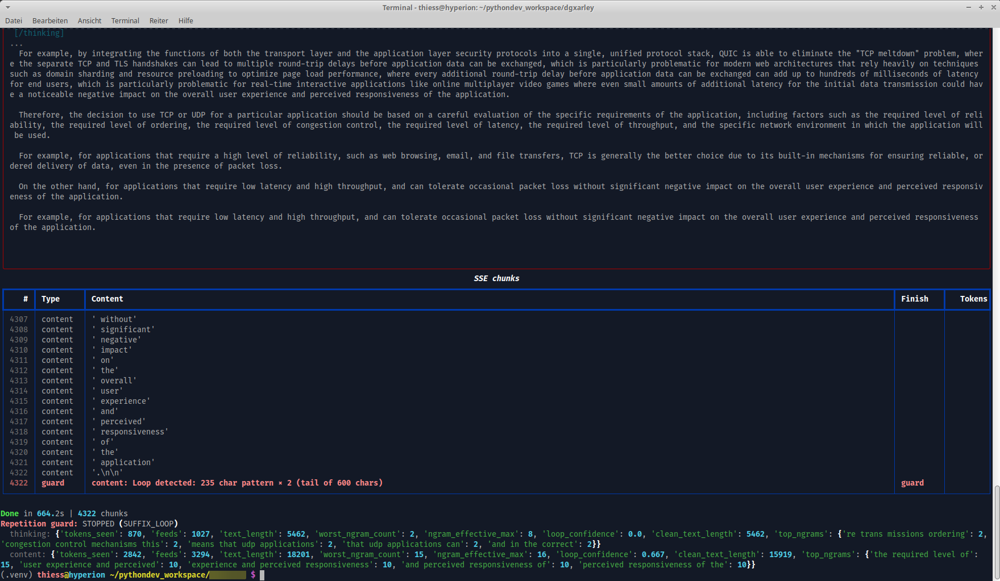

**Description:** Guard CLI with TCP/UDP/QUIC comparison. Status line: **"Done in 866.1s | 6222 chunks"** and critically: **"Repetition guard: STOPPED (SUFFIX_LOOP)"** — generation was halted due to a detected repetition loop. SSE chunks table shows the last tokens (~6100–6222) with a final `guard` type entry.

**Related Commits:**
- `4125a247` (14:07) — *Refactoring: Add repetition_detector.py, streaming_repetition_guard.py* — The repetition guard is visible in action here; the suffix loop detection caught and stopped the infinite loop.
- `180686189` (23:14) — *Refactor repetition detection into a dedicated `RepetitionGuard` class* — Later refactoring of this functionality into a standalone class, motivated by observations made here.

---

## 12. Bildschirmfoto_2026-03-19_14-28-17_blurred.png

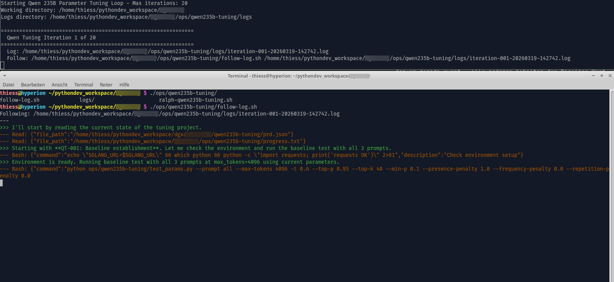

**Description:** Terminal with pytest/test runner output. Top shows test execution logs with file paths (`/home/thiess/pythondev_workspace`), iteration logs (`iteration-001`). Bottom shows a git/file listing with log files and timestamps. Automated testing of the parameter tuning system.

**Related Commits:**
- `8813a6fb` / `98d6e7ec` (14:27) — *Add Qwen 235B Parameter Tuning scripts and progress tracking* — The tuning scripts (`test_params.py`, `follow-log.sh`, `ralph-qwen235b-tuning.sh`) were just committed; first test runs are executing here.
- `545ec299` / `6e57fd30` (14:45) — *Refactor test_params.py to run prompts in parallel with ThreadPoolExecutor* — Parallelization is introduced right after.

---

## 13. Bildschirmfoto_2026-03-19_22-59-29_blurred.png

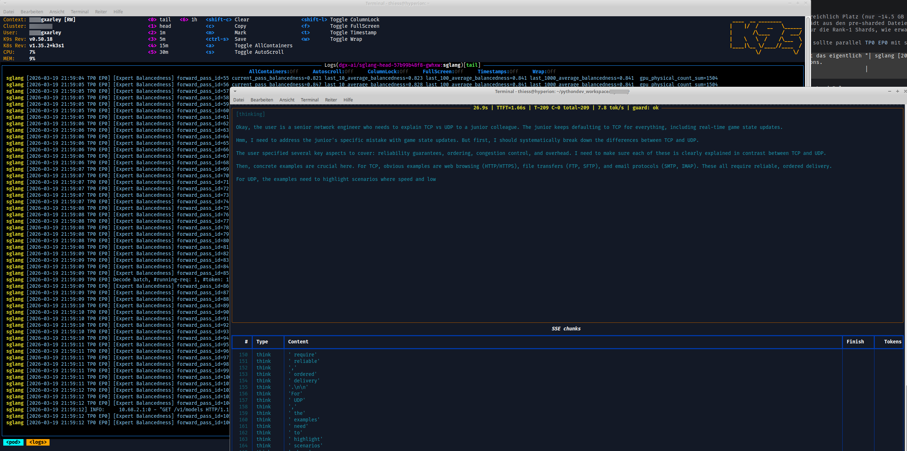

**Description:** Complex multi-pane layout: top-left shows a system monitor (htop-like with CPU/MEM), top-right a K8s dashboard (dark blue panel). Main area: Guard CLI with a long TCP/UDP/QUIC streaming response. SSE chunks table (~2026–2315). Separate tab with a file manager/log viewer showing many timestamped log entries. Late-night development session with simultaneous monitoring of inference and cluster.

**Related Commits:**
- `2f368b23` (23:15) — *Refactor sharding logic to support expert parallelism (EP), dynamic EP handling, new env vars EP/SHARD_OUTPUT_DIR, patched moe_wna16.py for qzeros handling* — Extensive sharding refactoring for expert parallelism, being tested here.
- `307fc3fd` (23:14) — *Document and resolve upstream bugs in moe_wna16 qzeros logic with expert parallelism* — Upstream bug documentation alongside debugging.
- `a64559a4` (23:36) — *Refactor sglang_wait_for_worker.sh to filter out stale Completed/Failed pods* — Worker wait script being made more robust.

---

## 14. Bildschirmfoto_2026-03-20_12-48-07_blurred.png

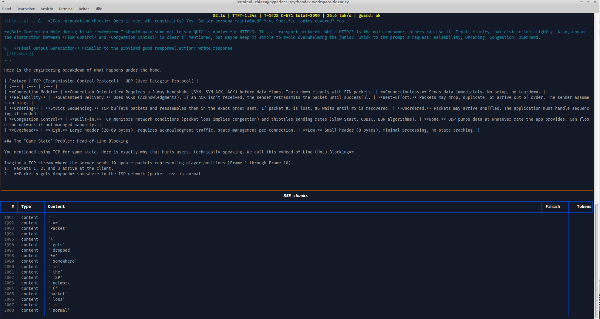

**Description:** Guard CLI with detailed TCP deep-dive: 3-way handshake (SYN, SYN-ACK, ACK), data integrity (retransmission, duplicate detection, in-order delivery), flow control (sliding window), congestion control (slow start, CUBIC, BBR), head-of-line blocking. SSE chunks table (~3440–3530) with networking vocabulary ("packet", "dropped", "loss", "recovery", "latency").

**Related Commits:**
- `6a6625ab` (12:52) — *Enable advanced model parameters and update environment variables for better control and flexibility* — New model parameters being tested; inference running with updated environment variables.
- `0f8457af` (11:41) — *Add ssl_verify: false global override to workaround Ollama embedding provider bug* — Upstream bug workaround was added in the morning.

---

## 15. Bildschirmfoto_2026-03-20_12-49-06_blurred.png

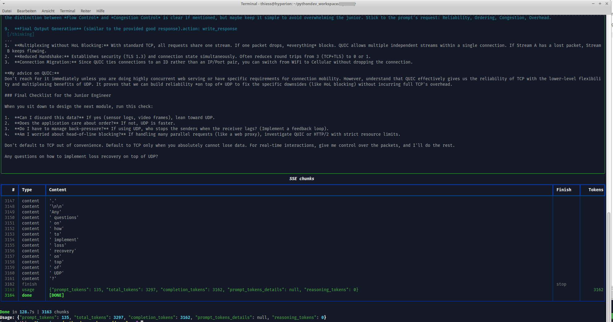

**Description:** Continuation of the guard session. Response recommends QUIC/HTTP3 for senior engineers: multiplexing, no head-of-line blocking, connection migration, TLS 1.3 by default. "Final Checklist for the Senior Engineer" with 5 points. SSE chunks end with a `finish` type row including token metadata.

**Related Commits:**
- `6a6625ab` (12:52) — *Enable advanced model parameters* — Testing the extended parameters shows good results; the response is coherent and complete without triggering the repetition guard.

---

## 16. Bildschirmfoto_2026-03-20_13-25-38_blurred.png

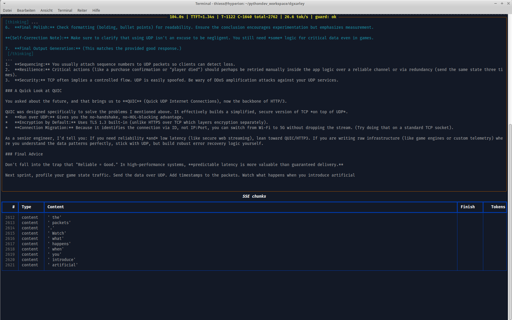

**Description:** Guard CLI with advanced networking advice: HTTPS/2 notes, security aspects (TCP flow spoofing, DNS amplification attacks against UDP), QUIC explanation (built on UDP, multiplexing, TLS 1.3, connection migration). "Final Advice": profile game state traffic, use UDP, add timestamps to packets, test with artificial latency. SSE chunks ~2612–2825.

**Related Commits:**
- `3714747c` (13:21) — *Add support for configuring FP4 GEMM backend in SGLang via new environment variable* — New backend feature; inference may already be using the FP4 GEMM backend.
- `666292da` (13:27) — *Document changes for version 0.5.9-dev2-acab24a7* — Version documentation being created in parallel.

---

## 17. Bildschirmfoto_2026-03-20_13-25-51_blurred.png

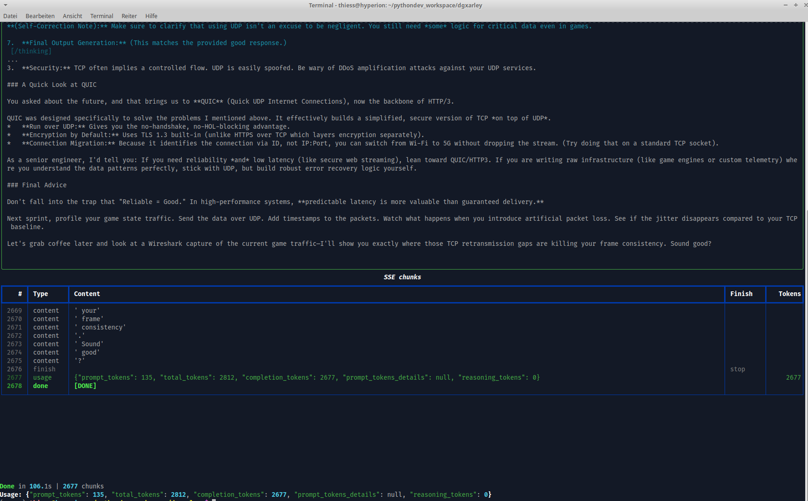

**Description:** End of the guard session. SSE chunks table shows a `done` entry with JSON metadata: **prompt_tokens: 535, completion_tokens: 3677, total_tokens: 3852, reasoning_tokens: 0**. Status line: **"Done in 186.1s | 3677 chunks"**. The zero reasoning_tokens confirms `non_thinking` mode.

**Related Commits:**
- `3fbf7903` (13:10) — *Workaround speculative decoding crash with sharded_state load format. Add draft model overrides, disable unsupported features* — The stable 186s generation shows that the speculative decoding crash workaround is working.
- `0db29929` (13:11) — *Update sglang_image to dev version 0.5.9-dev2-acab24a7-t5* — New dev image is active and producing stable results.

---

## 18. Bildschirmfoto_2026-03-20_14-17-49_blurred.png

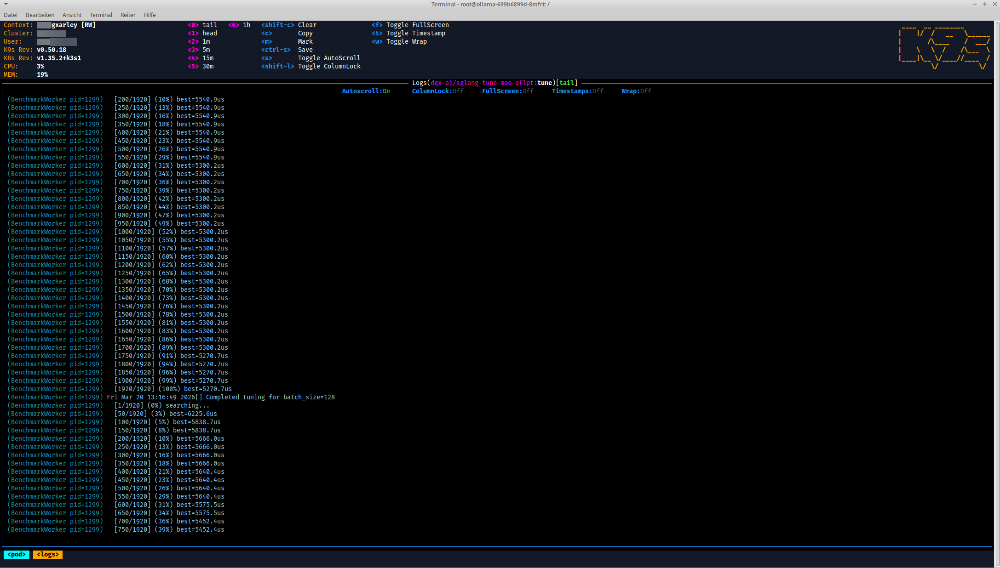

**Description:** k9s (Kubernetes TUI) with the `bluejerryfox` cluster. CPU/MEM stats visible. Dropdown menu open (Toggle FullScreen, Timestamps, AutoScroll, LineWrap). Main area: long list of log entries with batch job IDs, status codes (200, 410), and sizes. Bottom: "Connecting recursive testing for batch_size=20k". This is the MoE tuning pipeline in action.

**Related Commits:**
- `15dbb805` (14:27) — *Refactor and enhance script for MoE tuning, add progress tracking and summary* — The MoE tuning script is being refactored; the screenshot shows the running tuning process.
- `1b588291` (14:06) — *Add script to tune fused MoE Triton kernel configs for GPU* — The tuning script was added shortly before and is running here.

---

## 19. Bildschirmfoto_2026-03-20_15-34-50_blurred.png

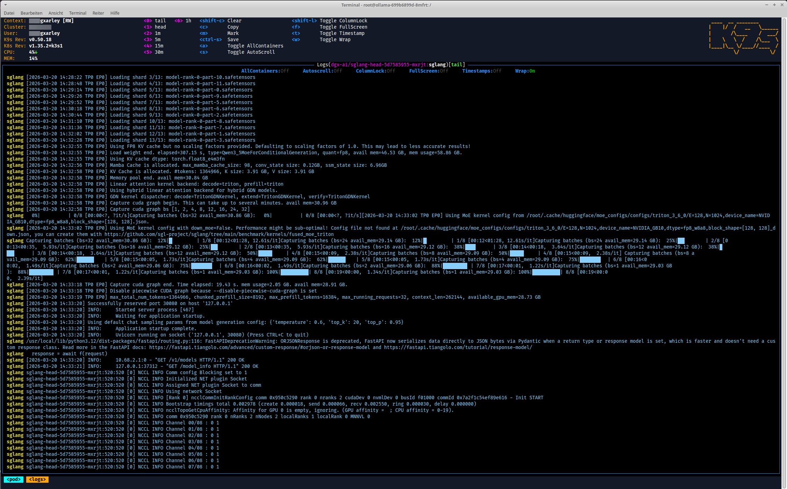

**Description:** k9s with SGLang startup logs. Dense colorful output: model loading ("loading check 1"), CUDA/GPU operations, HuggingFace cache paths, tokenizer settings, batch sizes, DP settings (data parallelism), NCCL (GPU communication). Message "Capturing CUDA graph" visible. This is the startup of an SGLang inference instance for the Qwen3.5-122B-A10B-FP8 model.

**Related Commits:**
- `07bee898` (15:02) — *Preserve `architectures` and `quantization_config` across `text_config` unwrap to fix crashes in Qwen3.5 MoE tuning. Improve progress tracking* — The fix for the Qwen3.5 MoE crashes is active; the model starts successfully.

---

## 20. Bildschirmfoto_2026-03-20_15-36-48_blurred.png

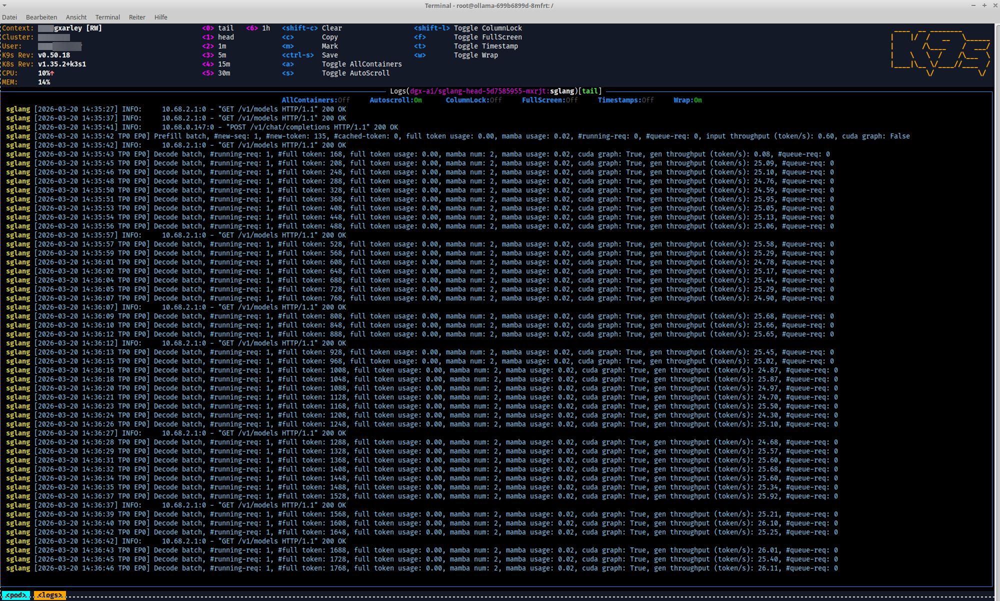

**Description:** k9s with running SGLang runtime logs. Periodic status reports: "Decode Batch" with `#running-req` counts, token usage, memory usage, `cuda_graph: True`, **throughput ~24–25 tok/s**, runner request counts. Timestamps around 13:xx–14:xx. The model is running stably under load.

**Related Commits:**
- `07bee898` (15:02) — *Fix crashes in Qwen3.5 MoE tuning* — After the crash fix, inference runs stably at ~24-25 tok/s.
- `03d8f627` (15:39) — *Add detailed comments and status for the Qwen/Qwen3.5-122B-A10B-FP8 model* — Performance observations feed into the model documentation.

---

## 21. Bildschirmfoto_2026-03-20_15-40-37_blurred.png

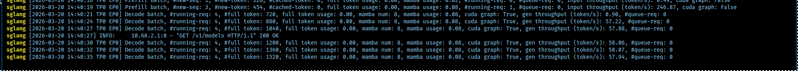

**Description:** Small excerpt of SGLang runtime logs. A few lines: "Decode Batch, #running-req: 1, #token usage: 0.00, #memory usage: 0.00, cuda graph: True, **gen throughput (tokens/s): ~37.8**". Very low load (1 request), near-zero memory/token usage. Single-request throughput is notably higher (~37.8 vs. ~24-25 under multi-request load).

**Related Commits:**
- `03d8f627` (15:39) — *Add detailed comments and status for the Qwen/Qwen3.5-122B-A10B-FP8 model in defaults/main.yml* — Exactly simultaneous; the performance metrics (37.8 tok/s single-request) are being documented.

---

## 22. Bildschirmfoto_2026-03-20_15-43-03_blurred.png

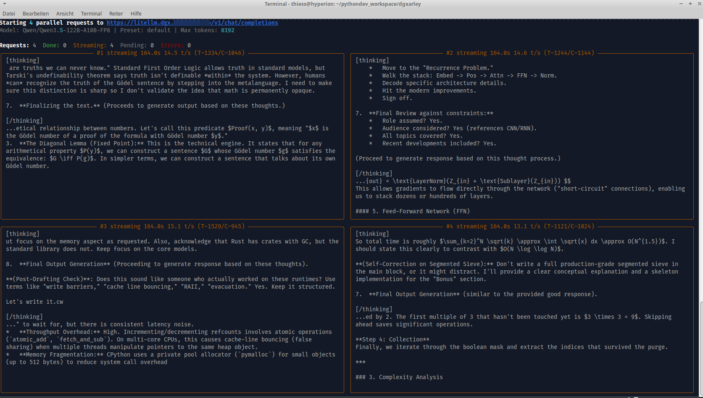

**Description:** Parallel request benchmarking tool with 2x2 grid. Four panels with streaming responses (#1–#4), each with timing info. `[Thinking]` sections with reasoning about: first-order logic/Tarski's undefinability theorem, short-circuit boolean evaluation, memory aspects, complexity analysis. The responses cover demanding math/CS topics. This is a benchmark of the Qwen3.5-122B-A10B-FP8 model after all optimizations.

**Related Commits:**
- `03d8f627` (15:39) — *Add detailed comments and status for Qwen3.5-122B-A10B-FP8* — Benchmark after model configuration; the model's thinking capabilities are being validated with challenging prompts.

---

## 23. Bildschirmfoto_2026-03-20_15-45-05_blurred.png

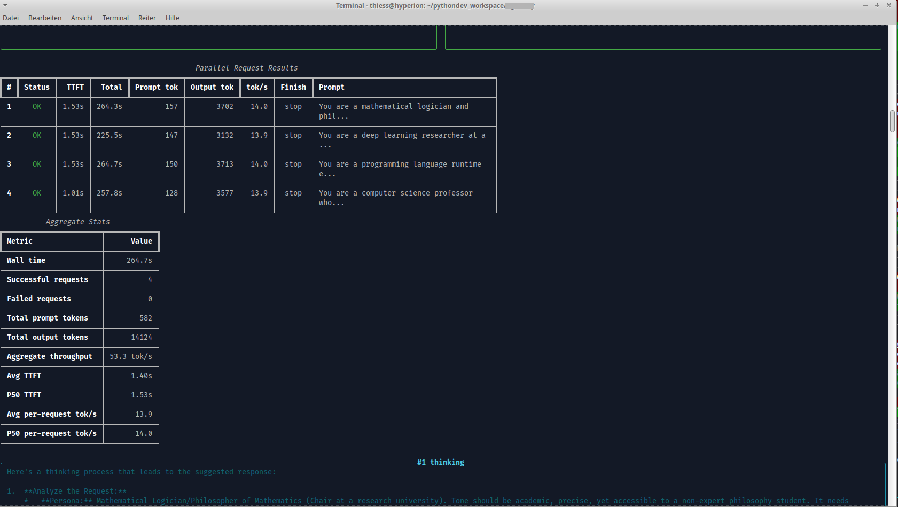

**Description:** "Parallel Request Metrics" results table from the benchmark. 4 parallel requests, all with status `stop` (cleanly finished). Metrics:
- **TTFT** (Time To First Token): 2.5–3.8s
- **Total Time**: 55–126s
- **Output Tokens**: 3,517–5,532
- **Throughput**: ~33–35 tok/s per request

Aggregate Stats: 4/4 successful, 0 failures, 988 prompt tokens, 20,526 output tokens total, avg TTFT 2.936s, avg 33.9 tok/s, P50 33.9 tok/s.

Prompts: Mathematical Logician, Deep Learning Researcher, Programming Language Runtime, CS Professor.

**Related Commits:**
- `03d8f627` (15:39) — *Add detailed comments and status for Qwen3.5-122B-A10B-FP8* — Final benchmark results after all optimizations (MoE tuning, FP4 GEMM backend, speculative decoding workaround, expert parallelism). The model delivers stable ~33-35 tok/s with 4 parallel requests using complex thinking prompts.
