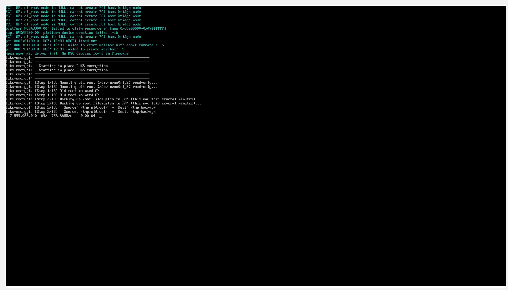
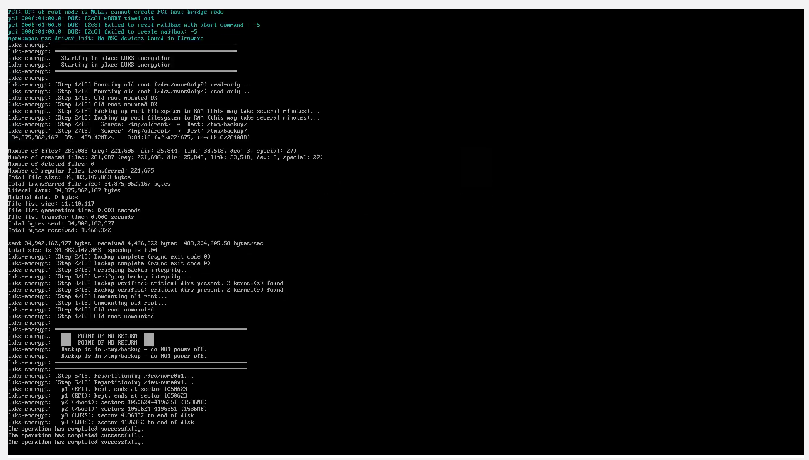
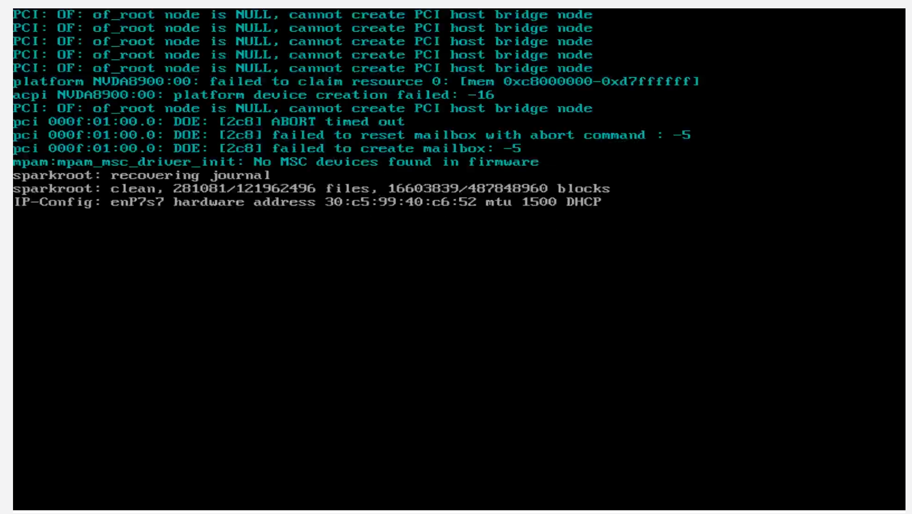
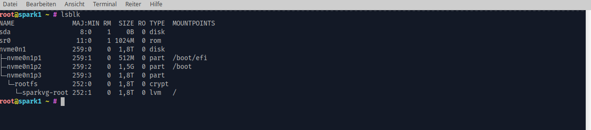

# scripts

Standalone helper scripts that are run manually outside of Ansible playbooks.

## luks_encrypt_spark.sh

In-place LUKS encryption for DGX Spark (ARM64) root partitions **without requiring a live USB boot**. The entire process runs from the live system using a two-phase approach that backs up the root filesystem to RAM, repartitions, encrypts, and restores.

### Why

The DGX Spark / ASUS Ascent GX10 ships with an unencrypted NVMe root partition. LUKS encryption is required for data-at-rest security, but the ARM64 platform lacks trivial live USB boot support. This script solves that by performing encryption in-place via initramfs.

### How it works

**Phase A** (online, this script):
1. Validates system (ARM64, NVMe, 2-partition layout, sufficient RAM)
2. Installs required packages (`cryptsetup-initramfs`, `clevis-initramfs`, `lvm2`, `rsync`, `gdisk`)
3. Configures initramfs networking (for clevis/tang on future boots)
4. Prompts for LUKS passphrase
5. Deploys initramfs hook + premount script
6. Rebuilds initramfs

**Phase B** (initramfs premount, next boot — fully automated):
1. Mounts old root read-only
2. Backs up entire root filesystem to RAM via rsync (~7GB, takes ~1 min on 128GB nodes)
3. Verifies backup integrity (critical dirs, kernel presence)
4. **Point of no return** — repartitions NVMe (p2=1.5GB /boot, p3=LUKS remainder)
5. LUKS2 formats p3 (aes-xts-plain64, argon2id)
6. Creates LVM (sparkvg/root) inside LUKS
7. Restores backup to encrypted root
8. Updates fstab, crypttab, GRUB config
9. Self-destructs encryption hooks from new root
10. Rebuilds initramfs + GRUB in chroot
11. Reboots

### Partition layout

```
Before:                          After:
nvme0n1p1  vfat   537MB  EFI    nvme0n1p1  vfat   537MB  /boot/efi  (untouched)
nvme0n1p2  ext4   ~2TB   /      nvme0n1p2  ext4   1.5GB  /boot      (new)
                                 nvme0n1p3  LUKS2  ~2TB   LUKS -> sparkvg/root -> /
```

### Usage

```bash
# Prep system for encryption (interactive, asks for LUKS passphrase)
sudo ./luks_encrypt_spark.sh

# Check if encryption is pending
sudo ./luks_encrypt_spark.sh --status

# Cancel pending encryption (removes hooks, rebuilds initramfs)
sudo ./luks_encrypt_spark.sh --abort

# Dry run (show plan without executing)
sudo ./luks_encrypt_spark.sh --dry-run
```

### Screenshots

**Step 1-2: Mounting old root and backing up to RAM**



**Steps 3-9: Backup complete, point of no return, repartition, LUKS format, LVM, restore, GRUB rebuild**



**Post-reboot: fsck on encrypted root, DHCP for clevis network**



**Final result: `lsblk` showing encrypted partition layout**



### Safety features

- **Pre-flight checks**: Validates architecture, partition layout, RAM vs data size, no pending encryption
- **Before point of no return**: Any error aborts safely, normal boot continues after 10s delay
- **After point of no return**: Error handler drops to emergency shell with backup still in `/tmp/backup` (RAM)
- **Self-destruct**: Encryption hooks are removed from the new root after successful encryption, preventing re-runs
- **`--abort` flag**: Cleanly removes all hooks and config, rebuilds initramfs

### After encryption

On first boot after encryption, enter the LUKS passphrase manually at the prompt. Then bind clevis/tang for automatic unlock on subsequent boots:

```bash
ansible-playbook common.yml --limit spark1 --tags clevis \
  -e 'wantsclevis=true clevis_luks_passphrase=YOUR_PASSPHRASE'
```

### Requirements

- DGX Spark / ASUS Ascent GX10 (ARM64) with standard 2-partition NVMe layout
- Sufficient RAM to hold the entire root filesystem (~128GB nodes have plenty)
- Network connectivity for package installation (Phase A) and clevis/tang (post-encryption)
- Must run as root on the live Spark node (not via SSH from a different machine's filesystem)
